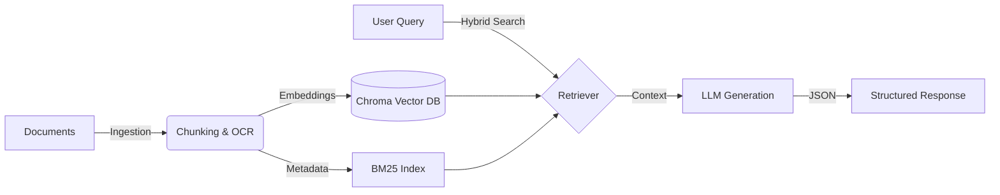
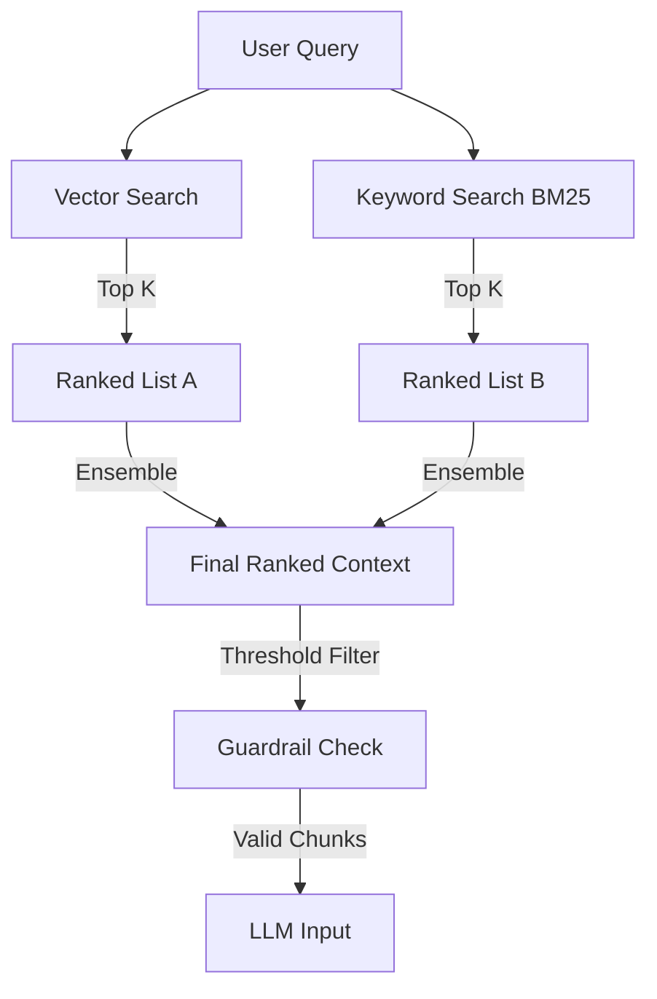

# 🤖 RAG Use Case Generator

A local, file-based Retrieval-Augmented Generation (RAG) system that transforms product documentation (PDFs, Word Docs, Images, Text) into structured, high-quality software use cases.

Built with **LangChain**, **Streamlit**, **ChromaDB**, and **Groq**.

---

## 🚀 Quick Start

### 1. Prerequisites
- **Python 3.10+**
- **Tesseract OCR** (Required for processing images)
  - Windows: [Download Installer](https://github.com/UB-Mannheim/tesseract/wiki) (Add to PATH)
  - Mac: `brew install tesseract`
  - Linux: `sudo apt install tesseract-ocr`
- **Groq API Key**: [Get one here](https://console.groq.com/) (Free tier available)

### 2. Installation
```bash
# Clone the repo
git clone <your-repo-url>
cd Sujal_Rag

# Install dependencies
pip install -r requirements.txt
```

### 3. Configuration
Copy the example environment file:
```bash
cp .env.example .env
```
Open `.env` and add your API Key:
```
GROQ_API_KEY=gsk_your_key_here
```
*(Alternatively, you can skip this and enter the key in the UI sidebar)*

### 4. Run the App
```bash
streamlit run src/app.py
```

---

## 🛠️ Usage

### Option A: Automatic Ingestion (Recommended)
1. Place your project files (PDFs, screenshots, docx) in the `Dataset/` folder.
2. In the App Sidebar, click **"📥 Ingest 'Dataset' Folder"**.
3. Wait for the success message.

### Option B: Manual Upload
1. Drag and drop files directly into the Sidebar upload area.
2. Click **"Process Files"**.

### Generative Query
Ask questions like:
> "Create use cases for user signup"
> "Generate negative test cases for the login flow"
> "What are the verification rules?"

The system will return a **Structured JSON** response grounded strictly in your documents.

---

## 🏗️ Architecture

The system follows a modular RAG pipeline:

### High-Level Data Flow


### 1. Ingestion (`src/ingestion.py`)
- **Multi-modal Loading**:
  - `docx`, `pdf`, `txt`, `md`: Native text extraction.
  - `png`, `jpg`: OCR using `pytesseract`.
- **Chunking**: Recursive character split (1000 chars, 200 overlap).
- **Guardrails**:
  - **Deduplication**: MD5 hashing prevents processing duplicate blocks.
  - **Garbage Filter**: Removes low-quality or too-short OCR headers/footers.
- **Vector Store**: `ChromaDB` (Local) with `HuggingFaceEmbeddings` (running on CPU).

### 2. Retrieval (`src/retrieval.py`)
- **Hybrid Search**: Combines **Vector Search** (Semantic) + **BM25** (Keyword).
- **Ensemble**: Weights results 50/50 to ensure both conceptual and exact matches are found.
- **Result**: Returns top-k relevant chunks with metadata (Source File, Page Number).



### 3. Generation (`src/generation.py`)
- **Model**: `llama-3.3-70b-versatile` via Groq (Fast, high-performance).
- **Strict Guardrails**:
  - **Scope Enforcement**: Rejects queries unrelated to retrieved context.
  - **Anti-Hallucination**: Returns `insufficient_context: true` and empty lists if evidence is missing.
  - **Format**: JSON-only output (Pydantic enforced).
- **Retry Mechanism**: Automatically fixes malformed JSON output by re-prompting the LLM.

### 4. UI (`src/app.py`)
- **Streamlit**: Interactive frontend.
- **Debug Mode**: Shows the exact text chunks used to generate the answer for transparency.
- **Dynamic Config**: API Key input, retrieval depth slider.

---

## 🛡️ Safeguards & Protections

1. **Hallucination Protection**: The system is prompted to *never* invent features. If docs are missing ("password rules"), it will explicitly state "Insufficient Context" rather than guessing "8 characters".
2. **Prompt Injection Defense**: System ignores instructions found *inside* user documents (e.g., "Ignore previous rules").
3. **Structured Output**: Uses Pydantic validation to ensure the output is always parseable JSON, never markdown or prose.

---

## 💻 Tech Stack & Tools

- **Language**: Python 3.12
- **Frameworks**: LangChain, Streamlit
- **Vector DB**: ChromaDB
- **LLM Provider**: Groq
- **OCR**: Tesseract
- **IDEs**: VS Code
- **Linter**: Standard Python best practices

---

## 📂 Project Structure
```
/
├── Dataset/            # Place your data here
├── chroma_db/          # Local vector storage (auto-generated)
├── src/
│   ├── app.py          # Main UI
│   ├── ingestion.py    # File usage & DB creation
│   ├── retrieval.py    # Search logic
│   ├── generation.py   # LLM interaction & Prompting
│   └── utils.py        # Helpers
├── requirements.txt    # Python deps
├── README.md           # This file
└── .env                # Config
```

---

*Verified for robustness against generic test case hallucination.*
